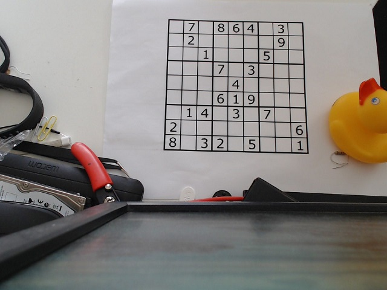
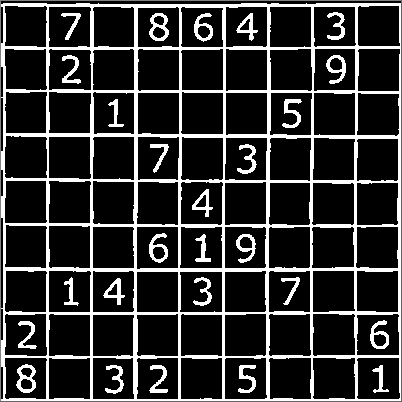
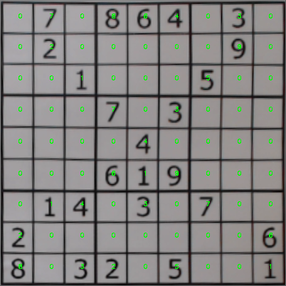
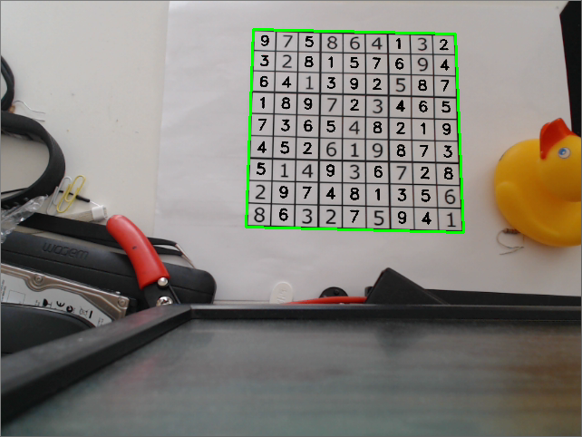

# webcam-sudoku-solver

## Introduction
This is a project mainly to explore OpenCV. Since I don't know how to play sudoku at all, it would be nice if I could create something that can do it for me. Here it is.

## How to run
### Install dependencies
Make sure you have Python 2.7. __Does not__ work with Python 3.
```
pip install -r requirements.txt
```
That should bring you all the dependencies.

### Train the neural network model
```
cd src
python nn_train.py
```
This takes a while. I am using a simple NN to do the digit recognition. The result is not quite satisfactory. So here is a __TODO__. 

### Execute the program
```
python main.py
```

## How does it work
First thing is of course get the video buffer from the camera, like this:


Then extract the contours, try to find a sudoku board. If a qualified square contour is found, project it as an orthophoto, and do some pre-processing to it.


After successfully extract the board, run Hough line transformation on it. If everything goes right, effectively each cell is determined. Then we can do the digit recognition on each cell. Empty cells are denoted as 0. 


Once we have a grid of digits, we can use the solver to solve it! In this project, a [Z3](https://github.com/Z3Prover/z3) solver is used. Basically model the problem as a CSP, then Z3 can give the arrangment efficiently. Which bring us to the final result:

